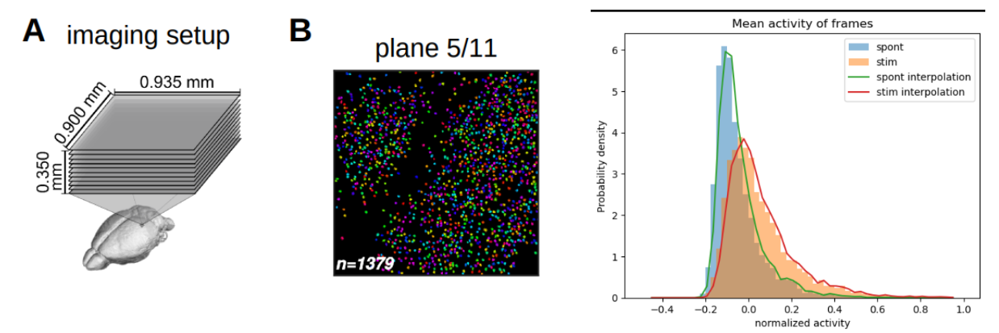
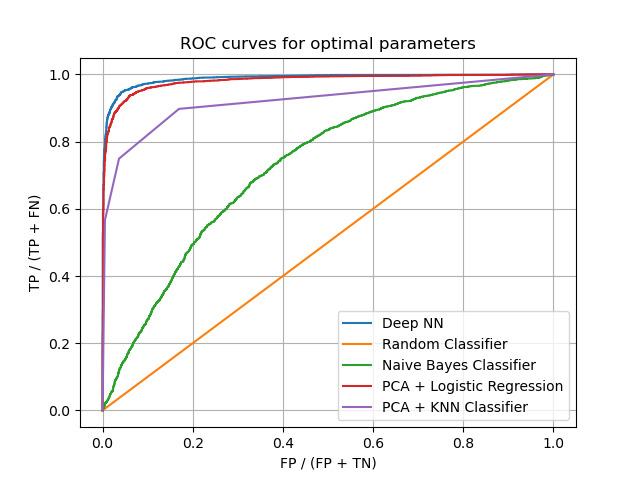

# Supervised Classification of neural states in mice

## Organization of the directory and information about the problem

**The main objective of this project is to train a set of models for supervised classification of neural states in mice.**

Over the last 15 years, the amount and quality of data associated with this problem have been growing, presenting the opportunity to train machine learning models to classify these neural states. In a typical experiment, mice are subjected to visual stimuli while running on a treadmill, and their neural activity is recorded, in this case using optogenetic techniques in the visual cortex.

The pre-processed data are acquired from a 2018 paper:

[Carsen Stringer, Marius Pachitariu, Nicholas Steinmetz, Charu Bai Reddy, Matteo Carandini, Kenneth D. Harris. "Spontaneous behaviors drive multidimensional, brain-wide population activity."](https://www.biorxiv.org/content/10.1101/306019v2)

The code for data acquisition can be found at: [GitHub](https://github.com/MouseLand/stringer-pachitariu-et-al-2018a)

Basically, the data is a matrix that records the activity of a given neuron (for this experiment, $N = 13101$ neurons in the visual cortex) at a given time (e.g., a frame). The data is sampled at approximately 30 Hz but also contains a vector that indicates if the mouse was being stimulated by the screen or not. The neurons were recorded from 11 different planes, but we are not considering the spatial dimensions of the data for this project, only the index of the neuron.

## What do I want to predict?

In the mentioned paper, they discovered that the spontaneous activity (without stimulus) and the stimulated activity exist in separate high-dimensional manifolds that are loosely orthogonal. Therefore, my question was: given only the activity pattern at a given frame, is there a way to predict if the mouse was looking at a picture or not, in other words, if it was stimulated or just seeing a black background? To attempt this, I experimented with several supervised learning algorithms and analyzed their performance.

## File organization 

All the anlysis and training is done on the analysis.ipynb notebook, the "/data" folder is empty and will be filled with the data once you start running the notebook, the data is downloaded from the Stringer dataset: https://figshare.com/articles/dataset/Recordings_of_ten_thousand_neurons_in_visual_cortex_during_spontaneous_behaviors/6163622

## Organization of the notebook

0) Data inspection 
1) Class Balancing using Random Undersampling and construction of the train and test datasets
2) Training a Bayes Classifier using the mean activity of the neurons in a given frame
3) Dimensionality Reduction of the full dataset using PCA
4) Training Logistic Regression on the PCA components
5) Training KNN Classification on the PCA components
6) Training a Deep Neural Network model
7) Conclusions and future improvements

## ROC curves for the different models used in the analysis

## Conclusions

Observing the final ROC curves, it is clear that the Deep Neural Network (DNN) model only marginally outperforms the PCA + Logistic Regression model. It is probable that with better hyper-parameter tuning, the neural network would have better performance. However, the logistic model required almost no tuning and has a quicker inference time.

The fact that logistic regression performs so well is consistent with findings in Stringer's original paper. They demonstrated that the datasets were linearly separable in space and that the gains from the nonlinear dimensionality reduction performed by the neural network are only marginal. Therefore, in a balance between performance and simplicity, I would recommend logistic regression.

## Further Improvements

The limitation of this analysis is that it is only valid for a single mouse. The database contains datasets from many mice where similar experiments were conducted but with different numbers of neurons. One improvement could be the construction of a dataset of "activation images" using information from the spatial coordinates of the neurons. This way, images of the visual cortex of other mice could be taken, and the model's performance could be tested on truly independent data.